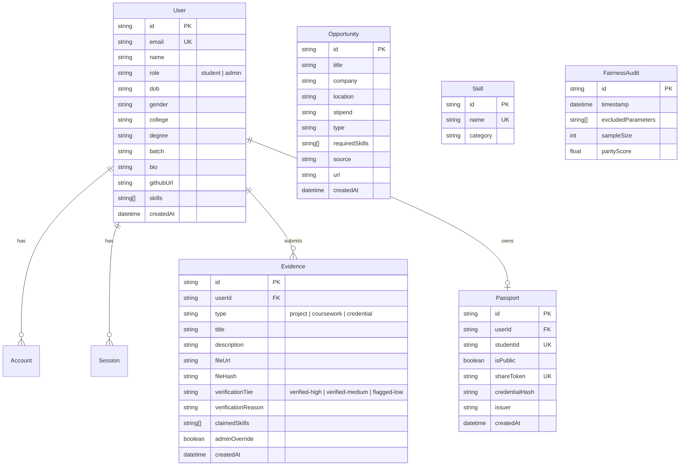

# SkillSync — Codebase Architecture & Component Reference Manual

> **SkillSync**: An automated, explainable, and bias-free talent verification and internship matching engine. Verifies coursework, projects, and credentials into a portable, cryptographically signed **Skill Passport**, and matches students with relevant opportunities without demographic bias.

---

## 1. System Overview & Technology Stack

SkillSync is built on a modern full-stack Next.js architecture with high-contrast UI design, hardware-accelerated animations, multi-factor credential verification, and deterministic algorithmic matching.

### Core Technology Stack

* **Framework**: [Next.js 16 (App Router)](https://nextjs.org/) with React 19 (`react`, `react-dom`)
* **Styling & Design System**: [Tailwind CSS v4](https://tailwindcss.com/) with PostCSS (`@tailwindcss/postcss`) and `clsx` / `tailwind-merge`
* **Database & ORM**: PostgreSQL managed via [Prisma ORM](https://www.prisma.io/) (`@prisma/client`, `prisma`)
* **Authentication**: [NextAuth.js v5 Beta](https://authjs.dev/) (`next-auth`, `@auth/prisma-adapter`, `bcryptjs`) supporting Credentials and GitHub OAuth
* **State & Server Cache**: [TanStack React Query v5](https://tanstack.com/query/v5) (`@tanstack/react-query`)
* **Motion & Physics**: [Framer Motion 13](https://www.framer.com/motion/) (`framer-motion`)
* **Icons & Visuals**: [Lucide React](https://lucide.dev/) (`lucide-react`)
* **Data Visualization**: [Recharts](https://recharts.org/) (`recharts`)
* **Document Generation**: [@react-pdf/renderer](https://react-pdf.org/) for cryptographic PDF Skill Passport certificates
* **Verification Utilities**: [jsQR](https://github.com/cozmo/jsQR) for QR payload decoding and native Node.js `crypto` for SHA-256 Merkle root hashing

---

## 2. Complete Codebase Directory Structure

```text
skillsync/
├── app/                                # Next.js 16 App Router Directory
│   ├── (auth)/                         # Unauthenticated Authentication Route Group
│   │   ├── signin/
│   │   │   └── page.js                 # Sign In (Credentials & GitHub OAuth)
│   │   └── signup/
│   │       └── page.js                 # Student Registration Page
│   ├── admin/                          # Administrative Portal & Review Console
│   │   ├── fairness/
│   │   │   └── page.js                 # Algorithmic Fairness & Demographic Parity Audits
│   │   ├── pipeline/
│   │   │   └── page.js                 # Evidence Verification Queue & Admin Overrides
│   │   ├── taxonomy/
│   │   │   └── page.js                 # Skill Taxonomy CRUD & Category Manager
│   │   ├── layout.js                   # Admin Shared Shell (HeaderNav + AdminNav)
│   │   └── page.js                     # Admin Overview Dashboard
│   ├── api/                            # Backend Serverless Route Handlers
│   │   ├── admin/
│   │   │   ├── fairness/route.js       # Fairness audit metrics and run simulation
│   │   │   ├── pipeline/route.js       # Verification queue list & tier override PATCH
│   │   │   └── taxonomy/route.js       # Skill taxonomy list, create, and delete
│   │   ├── auth/
│   │   │   ├── [...nextauth]/route.js  # NextAuth v5 authentication handlers
│   │   │   └── register/route.js       # Student account registration endpoint
│   │   ├── cron/
│   │   │   └── ingest/route.js         # Multi-source opportunity scraper cron job
│   │   ├── evidence/
│   │   │   └── route.js                # Evidence upload & automated verification pipeline
│   │   ├── github/
│   │   │   └── repos/route.js          # User GitHub repository retrieval & permissions
│   │   ├── opportunities/
│   │   │   ├── [id]/route.js           # Single opportunity & explainable match detail
│   │   │   └── route.js                # Opportunity feed with live match scores
│   │   ├── passport/
│   │   │   ├── [shareToken]/route.js   # Public verifiable passport lookup
│   │   │   ├── pdf/route.js            # Cryptographic PDF certificate stream
│   │   │   └── route.js                # Authenticated user passport & visibility toggle
│   │   └── profile/
│   │       └── route.js                # Student profile data GET & update PUT
│   ├── components/                     # Reusable React UI & Feature Components
│   │   ├── admin/
│   │   │   └── AdminNav.jsx            # Admin console sub-navigation bar
│   │   ├── auth/
│   │   │   └── AuthRequiredView.jsx    # Authentication required gatekeeper card
│   │   ├── evidence/
│   │   │   └── EvidenceCard.jsx        # Evidence item card with tier badge & hash
│   │   ├── landing/
│   │   │   ├── FAQSection.jsx          # Interactive accordion FAQ with motion reveals
│   │   │   ├── FeatureBento.jsx        # Bento grid showcasing core features
│   │   │   ├── FinalCTA.jsx            # Conversion banner with rolling buttons
│   │   │   ├── Hero.jsx                # Landing hero with animated cards & search preview
│   │   │   ├── Metrics.jsx             # Live impact statistics & verification metrics
│   │   │   ├── SmartAssist.jsx         # AI skill recommendation feature showcase
│   │   │   └── UseCaseTabs.jsx         # Persona walkthroughs (Students vs Employers)
│   │   ├── layout/
│   │   │   ├── Footer.jsx              # Global footer with navigation links & metadata
│   │   │   ├── HeaderNav.jsx           # Global navigation alias export
│   │   │   └── Navbar.jsx              # Global sticky navigation with auth state
│   │   ├── opportunities/
│   │   │   ├── MatchExplanationCard.jsx# Explainable match breakdown & fairness callout
│   │   │   └── OpportunityCard.jsx     # Opportunity preview card with match pill
│   │   ├── passport/
│   │   │   ├── InteractivePassportCard.jsx # 3D flippable emerald passport card & focus lightbox
│   │   │   ├── ShareExportButtons.jsx  # Export triggers (PDF, JSON, Public Link toggle)
│   │   │   └── SkillEvidenceModal.jsx  # Skill evidence citation popover modal
│   │   ├── profile/
│   │   │   └── ImageCropperModal.jsx   # Interactive canvas-based avatar photo cropper
│   │   └── ui/
│   │       ├── AnimatedButton.jsx      # Rolling text interactive action button
│   │       ├── Badge.jsx               # 3-tier verification badge & status pills
│   │       ├── ClickSpark.jsx          # Particle spark effect on user clicks
│   │       ├── FadeIn.jsx              # Framer Motion scroll entrance wrappers
│   │       ├── MagnifyingEvidence.jsx  # Animated magnifying glass micro-interaction
│   │       └── RollingText.jsx         # Kinetic letter-flipping text effect
│   ├── dashboard/                      # Student Dashboard
│   │   ├── evidence/
│   │   │   └── new/page.js             # Evidence submission form & GitHub selector
│   │   └── page.js                     # Student credential summary & evidence list
│   ├── data/                           # Mock & Static System Data
│   │   ├── mockData.js                 # Fallback mock records for demo & offline modes
│   │   └── skillsyncData.js            # Platform metadata, FAQ, and feature lists
│   ├── docs/                           # Documentation Portal
│   │   ├── BUILD_LOG.md                # Codebase architecture & component reference manual
│   │   ├── DESIGN_DOC.md               # Design token & aesthetic specification
│   │   └── page.js                     # In-app interactive documentation center
│   ├── hooks/                          # Custom Client React Hooks
│   │   └── useAuth.js                  # Client authentication status & session state
│   ├── opportunities/                  # Opportunities Feed & Matching
│   │   ├── [id]/
│   │   │   └── page.js                 # Opportunity detail & match breakdown centerpiece
│   │   └── page.js                     # Live internship feed with match filters
│   ├── passport/                       # Skill Passport Views
│   │   ├── [shareToken]/
│   │   │   └── page.js                 # Public shareable passport verification view
│   │   └── page.js                     # Authenticated student Skill Passport manager
│   ├── privacy/
│   │   └── page.js                     # Privacy policy & data protection terms
│   ├── profile/
│   │   └── page.js                     # Student profile editor, calendar DOB & avatar crop
│   ├── support/
│   │   └── page.js                     # Help center, FAQs, and support form
│   ├── terms/
│   │   └── page.js                     # Terms of service & verification guidelines
│   ├── globals.css                     # Global Tailwind styling, theme tokens & keyframes
│   ├── layout.js                       # Root HTML/Body layout with Geist fonts & providers
│   ├── page.js                         # Public landing page composition
│   ├── providers.js                    # SessionProvider, React Query & ClickSpark wrappers
│   └── template.js                     # Route transition wrapper
├── lib/                                # Core Business Logic, Services & Utilities
│   ├── config/
│   │   └── env.js                      # Environment variable validation & defaults
│   ├── external/
│   │   └── clients.js                  # External Supabase & Octokit client factories
│   ├── ingestion/                      # Multi-Source Job Scraper Adapters
│   │   ├── adzuna.js                   # Adzuna job search API adapter
│   │   ├── arbeitnow.js                # Arbeitnow remote job API adapter
│   │   ├── jobicy.js                   # Jobicy tech internship scraper
│   │   ├── jooble.js                   # Jooble search aggregator adapter
│   │   ├── normalize.js                # Unified opportunity schema normalizer
│   │   └── remotive.js                 # Remotive software engineering jobs adapter
│   ├── matching/                       # Algorithmic Match Engine & Fairness
│   │   ├── explainability.js           # Explainable match reason generation
│   │   ├── getMatchingFeatures.js      # Student competency feature extraction
│   │   └── scoring.js                  # Bias-free deterministic match scoring
│   ├── opportunities/
│   │   └── opportunityService.js       # Database opportunity queries and caching
│   ├── verification/                   # Automated Multi-Stage Verification Pipeline
│   │   ├── cryptoHash.js               # SHA-256 cryptographic Merkle root hasher
│   │   ├── githubCheck.js              # GitHub repository & commit verification
│   │   ├── ocrParser.js                # Document OCR text extraction parser
│   │   ├── pipeline.js                 # Verification orchestrator across stages
│   │   └── qrVerifier.js               # Cryptographic QR payload validator
│   ├── auth.js                         # NextAuth v5 configuration, credentials & OAuth
│   ├── prisma.js                       # Prisma Client singleton connection
│   └── utils.js                        # Tailwind class merge (`cn`) utility
├── prisma/
│   └── schema.prisma                   # PostgreSQL database schema & relational models
├── public/                             # Static Assets (Logos, SVGs, Images)
├── .env.example                        # Environment variable documentation template
├── next.config.mjs                     # Next.js build configuration & external image hosts
├── package.json                        # Project dependencies and npm scripts
├── postcss.config.mjs                  # PostCSS plugins configuration
└── proxy.js                            # Local development API proxy
```

---

## 3. Exhaustive Component Catalog & Usage Directory

Every component in SkillSync is built for modularity, accessibility, and high visual polish. Below is the complete catalog explaining each component's architecture, props, and exact usage locations.

```text
+-----------------------------------------------------------------------------------+
|                            SKILLSYNC COMPONENT TREE                               |
+-----------------------------------------------------------------------------------+
|                                                                                   |
|  [Root Layout / Providers] (layout.js, providers.js, template.js)                 |
|  ├── ClickSpark (Canvas Particle Sparks)                                          |
|  └── Global Navbar (Navbar.jsx / HeaderNav.jsx)                                   |
|                                                                                   |
|  [Landing Page] (app/page.js)                                                     |
|  ├── Hero.jsx (MagnifyingEvidence, RollingText, FadeIn, FadeInStagger)            |
|  ├── FeatureBento.jsx (Badge, FadeIn)                                             |
|  ├── UseCaseTabs.jsx (RollingText, FadeIn)                                        |
|  ├── Metrics.jsx (Recharts, FadeIn)                                               |
|  ├── SmartAssist.jsx (RollingText, FadeIn)                                        |
|  ├── FAQSection.jsx (RollingText, FadeIn, FadeInStagger)                           |
|  └── FinalCTA.jsx (RollingText, FadeIn)                                           |
|                                                                                   |
|  [Student Dashboard] (app/dashboard/page.js, app/dashboard/evidence/new/page.js)  |
|  ├── AuthRequiredView.jsx                                                         |
|  ├── EvidenceCard.jsx (Badge, RollingText)                                        |
|  └── GitHub Repo Selector & Evidence Upload Form (Badge)                          |
|                                                                                   |
|  [Opportunities Engine] (app/opportunities/page.js, app/opportunities/[id]/page) |
|  ├── AuthRequiredView.jsx                                                         |
|  ├── OpportunityCard.jsx (Work Mode Pill, Match Score Badge)                      |
|  └── MatchExplanationCard.jsx (Badge, Supporting Evidence, Missing Skills)        |
|                                                                                   |
|  [Skill Passport] (app/passport/page.js, app/passport/[shareToken]/page.js)       |
|  ├── AuthRequiredView.jsx                                                         |
|  ├── InteractivePassportCard.jsx (Luminous 3D Flip, Lightbox, Merkle Hash Proof)  |
|  │   └── SkillEvidenceModal.jsx (Badge, Evidence Citations)                       |
|  └── ShareExportButtons.jsx (RollingText, PDF Stream, Public Toggle)              |
|                                                                                   |
|  [Profile Editor] (app/profile/page.js)                                           |
|  ├── AuthRequiredView.jsx                                                         |
|  ├── ImageCropperModal.jsx (HTML5 Canvas Zoom/Pan/Rotate)                         |
|  └── Interactive Calendar DOB Picker                                              |
|                                                                                   |
|  [Admin Console] (app/admin/pipeline, /taxonomy, /fairness)                       |
|  ├── AdminNav.jsx (Pipeline Log, Taxonomy Manager, Fairness Audit tabs)           |
|  └── Verification Queue (Badge, Override Controls)                                |
|                                                                                   |
|  [Global Footer] (Footer.jsx)                                                     |
+-----------------------------------------------------------------------------------+
```

---

### 3.1. Layout & Navigation Components

#### 1. `Navbar.jsx`
* **File Path**: `app/components/layout/Navbar.jsx`
* **Purpose**: Primary global navigation header. Displays the SkillSync brand logo, core navigation links (`Dashboard`, `Skill Passport`, `Opportunities`, `Admin Console`, `Docs`), live authentication status, user profile avatar, and sign in/out controls.
* **Props & State**:
  * Consumes `useSession()` and `signOut()` from `next-auth/react`.
  * `mobileMenuOpen` (`boolean`): Controls mobile drawer toggle.
  * `userDropdownOpen` (`boolean`): Toggles user avatar popup menu.
* **Key Features**:
  * Responsive layout with full mobile overlay menu.
  * Active route indicator matching the current URL pathname.
  * Dynamic auth state: renders Sign In / Register buttons for guests, or student avatar with role badge for authenticated sessions.
* **Where It Is Used**:
  * `app/page.js` (Landing Page)
  * `app/(auth)/signin/page.js` (Sign In Page)
  * `app/(auth)/signup/page.js` (Sign Up Page)
  * `app/dashboard/page.js` (Student Dashboard)
  * `app/dashboard/evidence/new/page.js` (New Evidence Upload)
  * `app/opportunities/page.js` (Opportunities Feed)
  * `app/opportunities/[id]/page.js` (Opportunity Detail)
  * `app/passport/page.js` (Skill Passport Manager)
  * `app/profile/page.js` (Profile Editor)
  * `app/docs/page.js` (Docs Center)
  * `app/privacy/page.js` (Privacy Policy)
  * `app/terms/page.js` (Terms of Service)
  * `app/support/page.js` (Support Page)
  * `app/components/layout/HeaderNav.jsx` (Re-exported as default)

#### 2. `HeaderNav.jsx`
* **File Path**: `app/components/layout/HeaderNav.jsx`
* **Purpose**: Convenience wrapper and alias exporting `Navbar` for unified layout inclusion in administrative shells.
* **Where It Is Used**:
  * `app/admin/layout.js` (Admin Shared Shell)

#### 3. `Footer.jsx`
* **File Path**: `app/components/layout/Footer.jsx`
* **Purpose**: Global application footer providing categorized sitemaps, brand info, copyright, system status indicators, and legal links.
* **Props & State**: Stateless presentational component.
* **Key Features**:
  * Four structured link columns: Product, Developers & Docs, Legal & Fairness, Company.
  * Live status pill indicating "All verification engines operational".
* **Where It Is Used**:
  * `app/page.js` (Landing Page)
  * `app/docs/page.js` (Documentation Center)
  * `app/privacy/page.js` (Privacy Policy)
  * `app/terms/page.js` (Terms of Service)
  * `app/support/page.js` (Support Center)

---

### 3.2. Authentication & Gatekeeping Components

#### 4. `AuthRequiredView.jsx`
* **File Path**: `app/components/auth/AuthRequiredView.jsx`
* **Purpose**: Standardized, high-aesthetic security gatekeeper card displayed whenever an unauthenticated visitor attempts to access protected student features (Dashboard, Passport, Profile, Match Explanations).
* **Props**:
  * `badgeText` (`string`, default: `"Authentication Required"`): Tag pill text.
  * `badgeIcon` (`LucideIcon`, default: `Lock`): Icon displayed in badge.
  * `badgeColor` (`"emerald" | "amber" | "blue"`, default: `"emerald"`): Color theme for the badge.
  * `title` (`string`): Heading explaining the required action.
  * `subtitle` (`string`): Subheading describing the protected content.
  * `sectionName` (`string`): Name of the locked section.
  * `features` (`Array<{ icon, title, desc }>`): 3-card grid highlighting features unlocked upon sign in.
  * `publicLink` (`string`): Optional fallback URL (e.g. `/passport/sample-alex-chen`).
  * `publicLinkText` (`string`): Text for the public fallback button.
  * `backLink` (`string`): URL for back navigation button.
  * `backText` (`string`): Label for back navigation button.
* **Where It Is Used**:
  * `app/dashboard/page.js` (when student session is missing)
  * `app/dashboard/evidence/new/page.js` (when uploading evidence without sign-in)
  * `app/passport/page.js` (when viewing private passport manager without sign-in)
  * `app/profile/page.js` (when editing profile without sign-in)
  * `app/opportunities/page.js` (when viewing personalized matches without sign-in)
  * `app/opportunities/[id]/page.js` (when viewing individual match breakdowns without sign-in)

---

### 3.3. Interactive Skill Passport & Verifiable Credential Components

#### 5. `InteractivePassportCard.jsx`
* **File Path**: `app/components/passport/InteractivePassportCard.jsx`
* **Purpose**: The flagship visual component of the platform. A 3D flippable, emerald-themed verifiable credential card representing the student's verified skills, projects, institutional credentials, and cryptographic Merkle root hash.
* **Props**:
  * `passportData` (`object`): Passport record containing `studentName`, `studentId`, `college`, `degree`, `batch`, `dob`, `gender`, `githubUrl`, `skills`, `projects`, `credentialHash`, `isPublic`, `shareToken`, `issuer`, and `updatedAt`.
  * `className` (`string`): Optional additional CSS class names.
  * `showControls` (`boolean`, default: `true`): Toggles export and flip toolbar buttons.
  * `onTogglePublic` (`function`): Callback invoked when public sharing visibility is toggled.
* **Internal State**:
  * `isFlipped` (`boolean`): Flips card between Front (Credentials/Skills) and Back (Cryptographic Proof).
  * `isFocused` (`boolean`): Opens high-definition lightbox focus modal.
  * `selectedSkill` (`object`): Active skill hovered for evidence citation popovers.
  * `copiedId`, `copiedLink`, `copiedHash` (`boolean`): Copy-to-clipboard feedback states.
  * `isExportingPdf` (`boolean`): PDF download loading state.
* **Key Features**:
  * **Luxury Emerald Theme**: Deep gradient surface (`#0c382b` $\to$ `#09291f` $\to$ `#041711`), ambient glowing highlights, and curved vector watermark accents.
  * **Front Face**: Displays verified name, student ID (with one-click copy), institutional affiliation, date of birth, gender, GitHub link with repo stats, verified skills badges, and verified project cards.
  * **Back Face (3D Flip)**: Renders the Verifiable Credential Registry Proof, SHA-256 Merkle Root Hash (with copy trigger), W3C DID/VC compliance standard, and QR verification stamp.
  * **Focus Lightbox Modal**: Clicking the compact card launches a full-screen focus view wrapped in Framer Motion `<AnimatePresence>` with smooth exit zoom-out transitions and Escape key dismissal.
  * **Hover Evidence Citations**: Hovering any skill badge triggers `SkillEvidenceModal`.
* **Where It Is Used**:
  * `app/passport/page.js` (Student's private Passport Management portal)
  * `app/passport/[shareToken]/page.js` (Public Verifiable Passport verification page)

#### 6. `SkillEvidenceModal.jsx`
* **File Path**: `app/components/passport/SkillEvidenceModal.jsx`
* **Purpose**: Rich glassmorphic popover modal rendered when a user hovers over a skill badge on the Skill Passport card. Citations show the exact coursework, projects, or certificates that verified the competency.
* **Props**:
  * `skill` (`object`): Selected skill object with `name`, `category`, `tier`, `level`, and `evidenceList`.
  * `onClose` (`function`): Callback when the popover is dismissed.
* **Key Features**:
  * Shows verification tier badge (`verified-high`, `verified-medium`), competency level, and date.
  * Displays a list of specific evidence sources with direct links to GitHub repositories or credentials.
  * Matches the luxury emerald glassmorphism styling (`bg-[#092e23]/98 border-emerald-400/35`).
* **Where It Is Used**:
  * `app/components/passport/InteractivePassportCard.jsx` (Sub-component for skill badge citations)

#### 7. `ShareExportButtons.jsx`
* **File Path**: `app/components/passport/ShareExportButtons.jsx`
* **Purpose**: Passport export and sharing toolbar. Handles PDF certificate downloading, JSON-LD export, public sharing URL generation, and privacy toggles.
* **Props**:
  * `passportData` (`object`): Student passport record.
  * `isPublic` (`boolean`): Current sharing visibility status.
  * `shareToken` (`string`): Unique share token for public URL.
  * `onTogglePublic` (`function`): Callback when the public switch is toggled.
* **Key Features**:
  * **PDF Export**: Calls `/api/passport/pdf` to stream a cryptographically verifiable PDF.
  * **JSON-LD Export**: Downloads raw W3C-compliant JSON credential schema.
  * **Copy Share Link**: Copies `https://skillsync.edu/passport/[shareToken]` with animated confirmation.
* **Where It Is Used**:
  * `app/passport/page.js` (Skill Passport Toolbar)

---

### 3.4. Opportunities & Matching Components

#### 8. `OpportunityCard.jsx`
* **File Path**: `app/components/opportunities/OpportunityCard.jsx`
* **Purpose**: Card component for internship and job opportunities in the opportunities feed.
* **Props**:
  * `opportunity` (`object`): Contains `id`, `title`, `company`, `location`, `workMode`, `stipend`, `type`, `description`, `requiredSkills`, and calculated `matchScore`.
* **Key Features**:
  * **Distinct Work Mode Badges**:
    * **Remote**: Teal pill (`bg-teal-50 text-teal-800 border-teal-200`) with `Globe` icon.
    * **Hybrid**: Indigo pill (`bg-indigo-50 text-indigo-800 border-indigo-200`) with `Home` icon.
    * **On-site**: Amber pill (`bg-amber-50 text-amber-900 border-amber-200`) with `Building2` icon.
  * **Match Score Pill**:
    * Scores $\ge 75\%$: Highlighted in brand emerald (`bg-emerald-50 text-emerald-800 border-emerald-200`).
    * Scores $< 75\%$: Clean neutral slate pill (`bg-neutral-100 text-neutral-800 border-neutral-200`) to prevent color collisions with work mode tags.
  * Required skills checklist with verified green checkmarks.
* **Where It Is Used**:
  * `app/opportunities/page.js` (Live Opportunities Explorer Feed)

#### 9. `MatchExplanationCard.jsx`
* **File Path**: `app/components/opportunities/MatchExplanationCard.jsx`
* **Purpose**: Explainable Match Engine centerpiece displayed on opportunity detail pages. Explains *why* the student received their match score by citing verified evidence and highlighting missing skills.
* **Props**:
  * `explanation` (`object`): Match explanation payload containing `opportunity`, `matchScore`, `supportingEvidence`, `matchedSkills`, `citations`, and `missingSkills`.
  * `externalUrl` (`string`): Original job posting application link.
* **Key Features**:
  * **Compatibility Score Header**: Prominent match percentage badge with compatibility indicator.
  * **Supporting Verified Evidence**: Itemized list of student credentials that satisfied the role's required skills, with verification tier badges.
  * **Missing Skills & Next Actions**: List of unfulfilled skills with recommended courses or projects to bridge the gap.
  * **Direct Application Actions**: Direct links to apply on the original hiring source and search on LinkedIn.
* **Where It Is Used**:
  * `app/opportunities/[id]/page.js` (Opportunity Match Detail Centerpiece)

---

### 3.5. Evidence & Verification Components

#### 10. `EvidenceCard.jsx`
* **File Path**: `app/components/evidence/EvidenceCard.jsx`
* **Purpose**: Renders an individual verified evidence item (project, coursework, credential, competition) in student and administrative repository views.
* **Props**:
  * `evidence` (`object`): Evidence record containing `id`, `type`, `title`, `description`, `fileUrl`, `fileHash`, `verificationTier`, `verificationReason`, `verifiedAt`, `claimedSkills`, and `adminOverride`.
  * `onOverride` (`function`, optional): Admin callback to manually override the verification tier.
* **Key Features**:
  * Displays 3-tier verification badge (`Badge.jsx`).
  * Truncated SHA-256 cryptographic hash preview.
  * Direct "View Source" external link.
  * Rolling text "Override Tier" action button when `onOverride` is provided.
* **Where It Is Used**:
  * `app/dashboard/page.js` (Student Evidence Repository)

---

### 3.6. Administrative Portal Components

#### 11. `AdminNav.jsx`
* **File Path**: `app/components/admin/AdminNav.jsx`
* **Purpose**: Sub-navigation bar for the administrative portal. Provides quick switching between the verification pipeline queue, skill taxonomy manager, and algorithmic fairness audits.
* **Key Features**:
  * Highlights active tab using Next.js `usePathname()`.
  * Renders "Admin Console Session" security badge.
  * Three navigation routes:
    1. `/admin/pipeline` (Evidence Pipeline Log)
    2. `/admin/taxonomy` (Skill Taxonomy Manager)
    3. `/admin/fairness` (Algorithmic Fairness Audit)
* **Where It Is Used**:
  * `app/admin/layout.js` (Admin Shared Layout)

---

### 3.7. Student Profile Components

#### 12. `ImageCropperModal.jsx`
* **File Path**: `app/components/profile/ImageCropperModal.jsx`
* **Purpose**: Canvas-based interactive image cropping modal for student profile avatars.
* **Props**:
  * `imageSrc` (`string`): Raw data URL or image source selected by the user.
  * `onCancel` (`function`): Callback to dismiss the cropper without saving.
  * `onCropComplete` (`function(croppedDataUrl)`): Callback returning the optimized $256 \times 256$ JPEG avatar data URL.
  * `isProcessing` (`boolean`): Loading state during image generation/upload.
* **Key Features**:
  * **Interactive Canvas Controls**: Drag-to-pan, mouse wheel / slider zoom ($60\% - 300\%$), $90^\circ$ rotation, and reset triggers.
  * **Shape Toggle**: Switch between Circle and Rounded Square crop masks.
  * High-DPI canvas export ensuring sharp avatar rendering on all displays.
* **Where It Is Used**:
  * `app/profile/page.js` (Profile Photo Editor)

---

### 3.8. Landing Page Presentation Components

#### 13. `Hero.jsx`
* **File Path**: `app/components/landing/Hero.jsx`
* **Purpose**: Landing page hero section. Delivers the core value proposition with dynamic floating cards, search previews, rolling text CTAs, and trust metrics.
* **Where It Is Used**:
  * `app/page.js` (Landing Page)

#### 14. `FeatureBento.jsx`
* **File Path**: `app/components/landing/FeatureBento.jsx`
* **Purpose**: Bento grid showcase highlighting SkillSync's four core pillars:
  1. Multi-Tier Verification (High, Medium, Flagged).
  2. Cryptographic Skill Passport.
  3. Explainable & Bias-Free Match Engine.
  4. Instant Institutional & GitHub Sync.
* **Where It Is Used**:
  * `app/page.js` (Landing Page)

#### 15. `UseCaseTabs.jsx`
* **File Path**: `app/components/landing/UseCaseTabs.jsx`
* **Purpose**: Interactive tabbed section comparing value propositions for **Students** (verifiable proof, fair opportunities) and **Employers / Recruiters** (pre-vetted talent, 0% bias screening).
* **Where It Is Used**:
  * `app/page.js` (Landing Page)

#### 16. `Metrics.jsx`
* **File Path**: `app/components/landing/Metrics.jsx`
* **Purpose**: Live platform statistics and analytics display featuring Recharts charts, verification volume counters, demographic parity scores ($1.00$), and credential issuance numbers.
* **Where It Is Used**:
  * `app/page.js` (Landing Page)

#### 17. `SmartAssist.jsx`
* **File Path**: `app/components/landing/SmartAssist.jsx`
* **Purpose**: AI Skill Recommendation feature section showing how SkillSync analyzes uploaded evidence to suggest missing high-demand skills for target internships.
* **Where It Is Used**:
  * `app/page.js` (Landing Page)

#### 18. `FAQSection.jsx`
* **File Path**: `app/components/landing/FAQSection.jsx`
* **Purpose**: Interactive accordion FAQ answering technical, security, and verification questions with smooth Framer Motion height expansions.
* **Where It Is Used**:
  * `app/page.js` (Landing Page)

#### 19. `FinalCTA.jsx`
* **File Path**: `app/components/landing/FinalCTA.jsx`
* **Purpose**: High-conversion footer banner encouraging students to generate their Skill Passport and employers to access bias-free candidate pools.
* **Where It Is Used**:
  * `app/page.js` (Landing Page)

---

### 3.9. Primitive UI & Animation Components

#### 20. `Badge.jsx`
* **File Path**: `app/components/ui/Badge.jsx`
* **Purpose**: Standardized verification tier badge and status pill component.
* **Props**:
  * `tier` (`"verified-high" | "verified-medium" | "flagged-low"`): Determines color, label, and default icon.
  * `variant` (`"pill" | "outline" | "solid"`): Visual styling variant.
  * `icon` (`LucideIcon`): Custom icon override.
  * `showIcon` (`boolean`, default: `true`): Toggles icon rendering.
  * `className` (`string`): Additional CSS classes.
* **Visual Variants**:
  * **Verified High**: Emerald badge (`CheckCircle2` icon) — Cryptographic / registry verified.
  * **Verified Medium**: Amber badge (`AlertTriangle` icon) — Heuristic commit / coursework match.
  * **Flagged Low**: Rose badge (`ShieldAlert` icon) — Self-claim requiring review.
* **Where It Is Used**:
  * `app/components/evidence/EvidenceCard.jsx`
  * `app/components/opportunities/MatchExplanationCard.jsx`
  * `app/components/passport/SkillEvidenceModal.jsx`
  * `app/components/landing/FeatureBento.jsx`
  * `app/dashboard/page.js`
  * `app/dashboard/evidence/new/page.js`
  * `app/admin/pipeline/page.js`
  * `app/docs/page.js`

#### 21. `AnimatedButton.jsx`
* **File Path**: `app/components/ui/AnimatedButton.jsx`
* **Purpose**: Pill-shaped action button that automatically triggers kinetic `RollingText` letter flips upon hover and click.
* **Props**: `children`, `text`, `href`, `onClick`, `variant`, `size`, `className`, `icon: Icon`.
* **Where It Is Used**: Interactive CTA triggers across the application.

#### 22. `ClickSpark.jsx`
* **File Path**: `app/components/ui/ClickSpark.jsx`
* **Purpose**: Interactive canvas overlay that spawns radial particle sparks at the exact coordinates of user mouse clicks.
* **Props**: `sparkColor`, `sparkRadius`, `sparkSize`, `extraScale`, `children`.
* **Where It Is Used**:
  * `app/providers.js` (Wrapped around entire application tree)

#### 23. `FadeIn.jsx`
* **File Path**: `app/components/ui/FadeIn.jsx`
* **Exports**:
  * `<FadeIn>`: Single-element scroll reveal with customizable distance, duration, and delay.
  * `<FadeInStagger>`: Parent orchestration container that staggers reveal timing for child items.
  * `<FadeInItem>`: Child item inside a staggered container.
* **Where It Is Used**:
  * `app/components/landing/Hero.jsx`
  * `app/components/landing/FeatureBento.jsx`
  * `app/components/landing/UseCaseTabs.jsx`
  * `app/components/landing/Metrics.jsx`
  * `app/components/landing/SmartAssist.jsx`
  * `app/components/landing/FAQSection.jsx`
  * `app/components/landing/FinalCTA.jsx`

#### 24. `MagnifyingEvidence.jsx`
* **File Path**: `app/components/ui/MagnifyingEvidence.jsx`
* **Purpose**: Animated micro-interaction rendered over the word "evidence" in the Hero section, showing a magnifying lens scanning over verified badges.
* **Where It Is Used**:
  * `app/components/landing/Hero.jsx`

#### 25. `RollingText.jsx`
* **File Path**: `app/components/ui/RollingText.jsx`
* **Purpose**: High-performance kinetic typography component. Splits text into individual letters and flips them upwards with staggered timing on hover or mount.
* **Props**: `text`, `autoPlay`, `rollDuration`, `staggerDelay`, `textColor`, `font`, `animationTrigger`.
* **Where It Is Used**:
  * `app/components/landing/Hero.jsx`
  * `app/components/landing/FeatureBento.jsx`
  * `app/components/landing/UseCaseTabs.jsx`
  * `app/components/landing/SmartAssist.jsx`
  * `app/components/landing/FAQSection.jsx`
  * `app/components/landing/FinalCTA.jsx`
  * `app/components/passport/ShareExportButtons.jsx`
  * `app/components/evidence/EvidenceCard.jsx`
  * `app/components/ui/AnimatedButton.jsx`
  * `app/support/page.js`

---

## 4. App Router Pages & Application Routing Structure

| Route Path | File Location | Access Level | Description & Core Components Used |
| :--- | :--- | :--- | :--- |
| `/` | `app/page.js` | Public | **Platform Landing Page**: Assembles `Navbar`, `Hero`, `FeatureBento`, `UseCaseTabs`, `Metrics`, `SmartAssist`, `FAQSection`, `FinalCTA`, `Footer`. |
| `/signin` | `app/(auth)/signin/page.js` | Public (Guest) | **Sign In Page**: Email/Password login and GitHub OAuth button. |
| `/signup` | `app/(auth)/signup/page.js` | Public (Guest) | **Student Registration**: Creates student account and initializes empty Skill Passport. |
| `/dashboard` | `app/dashboard/page.js` | Protected | **Student Dashboard**: Displays verified skill counts, evidence repository (`EvidenceCard`), and passport preview. Gated by `AuthRequiredView`. |
| `/dashboard/evidence/new` | `app/dashboard/evidence/new/page.js` | Protected | **Evidence Upload**: Form for uploading coursework, certificates, or selecting connected GitHub repositories from a live dropdown. |
| `/opportunities` | `app/opportunities/page.js` | Public / Auth | **Opportunities Feed**: Filterable directory of internships with live match percentage pills (`OpportunityCard`). |
| `/opportunities/[id]` | `app/opportunities/[id]/page.js` | Public / Auth | **Opportunity Detail & Match Breakdown**: Displays role details and the centerpiece `MatchExplanationCard`. |
| `/passport` | `app/passport/page.js` | Protected | **Skill Passport Portal**: Student's interactive management view (`InteractivePassportCard`, `ShareExportButtons`). |
| `/passport/[shareToken]` | `app/passport/[shareToken]/page.js` | Public | **Public Verifiable Passport**: External URL for recruiters to inspect verified proof and cryptographic SHA-256 Merkle root. |
| `/profile` | `app/profile/page.js` | Protected | **Student Profile Editor**: Editable student bio, links, DOB calendar date picker, and `ImageCropperModal`. |
| `/admin` | `app/admin/page.js` | Admin Only | **Admin Portal Hub**: Overview of verification queues, active taxonomy, and system health. |
| `/admin/pipeline` | `app/admin/pipeline/page.js` | Admin Only | **Evidence Verification Queue**: List of submitted evidence with administrative tier override actions. |
| `/admin/taxonomy` | `app/admin/taxonomy/page.js` | Admin Only | **Skill Taxonomy Manager**: Create, view, and delete canonical skills and categories. |
| `/admin/fairness` | `app/admin/fairness/page.js` | Admin Only | **Fairness Audit Console**: Simulates and measures demographic parity across gender, college, and ethnicity. |
| `/docs` | `app/docs/page.js` | Public | **Documentation Center**: In-app architectural guide, API docs, and verification standards. |
| `/privacy` | `app/privacy/page.js` | Public | **Privacy Policy**: Zero-bias data handling and cryptographic hashing disclosure. |
| `/terms` | `app/terms/page.js` | Public | **Terms of Service**: Acceptable use, verification honesty, and credential portability terms. |
| `/support` | `app/support/page.js` | Public | **Support Portal**: Help center articles, contact support form, and FAQs. |

---

## 5. API Routes & Serverless Backend Endpoints

SkillSync implements RESTful Next.js Route Handlers with session validation, error boundaries, and Prisma database transactions:

### 5.1. Authentication
* **`POST /api/auth/register`** (`app/api/auth/register/route.js`)
  * Validates email uniqueness and hashes password with `bcryptjs`.
  * Creates `User` record and automatically provisions a unique `Passport` record with a secure `shareToken` and student ID.
* **`GET/POST /api/auth/[...nextauth]`** (`app/api/auth/[...nextauth]/route.js`)
  * NextAuth v5 handler supporting Credentials authentication and GitHub OAuth.

### 5.2. Profile & Student Evidence
* **`GET /api/profile`** (`app/api/profile/route.js`)
  * Returns authenticated student profile, skills array, and social URLs.
* **`PUT /api/profile`** (`app/api/profile/route.js`)
  * Updates profile details (bio, college, degree, batch, DOB, gender, avatar image URL, skills).
* **`GET /api/evidence`** (`app/api/evidence/route.js`)
  * Retrieves all evidence records submitted by the authenticated student.
* **`POST /api/evidence`** (`app/api/evidence/route.js`)
  * Processes evidence submission through `runVerificationPipeline`.
  * Computes SHA-256 hash, runs QR/GitHub/OCR verification, assigns tier (`verified-high`, `verified-medium`, `flagged-low`), and instantly syncs claimed skills into the user's Passport.
* **`GET /api/github/repos`** (`app/api/github/repos/route.js`)
  * Retrieves student's GitHub repositories via Octokit to populate the evidence repository dropdown.

### 5.3. Skill Passport & Verifiable Credentials
* **`GET /api/passport`** (`app/api/passport/route.js`)
  * Fetches authenticated student's passport, aggregating verified skills, projects, and SHA-256 Merkle root hash.
* **`PUT /api/passport`** (`app/api/passport/route.js`)
  * Updates passport privacy settings (toggles `isPublic` flag).
* **`GET /api/passport/[shareToken]`** (`app/api/passport/[shareToken]/route.js`)
  * Public lookup endpoint returning verified credential data for a given `shareToken` (or 404 if private).
* **`GET /api/passport/pdf`** (`app/api/passport/pdf/route.js`)
  * Generates and streams a signed PDF Certificate using `@react-pdf/renderer`.

### 5.4. Opportunities & Matching Engine
* **`GET /api/opportunities`** (`app/api/opportunities/route.js`)
  * Queries active opportunities and calculates real-time, bias-free match scores against the authenticated student's verified skills.
* **`GET /api/opportunities/[id]`** (`app/api/opportunities/[id]/route.js`)
  * Returns detailed opportunity data alongside complete explainable match breakdown (`supportingEvidence`, `matchedSkills`, `missingSkills`).
* **`GET /api/cron/ingest`** (`app/api/cron/ingest/route.js`)
  * Scraper cron endpoint that ingests internships from Adzuna, Arbeitnow, Jobicy, Jooble, and Remotive into the database.

### 5.5. Administrative Portal Endpoints
* **`GET /api/admin/pipeline`** (`app/api/admin/pipeline/route.js`)
  * Lists all submitted evidence records across all users with verification metadata.
* **`PATCH /api/admin/pipeline`** (`app/api/admin/pipeline/route.js`)
  * Allows administrators to manually override an evidence item's verification tier.
* **`GET /api/admin/taxonomy`** (`app/api/admin/taxonomy/route.js`)
  * Lists all canonical skills in the database taxonomy.
* **`POST /api/admin/taxonomy`** (`app/api/admin/taxonomy/route.js`)
  * Adds a new skill to the canonical taxonomy.
* **`DELETE /api/admin/taxonomy`** (`app/api/admin/taxonomy/route.js`)
  * Deletes a skill from the taxonomy.
* **`GET /api/admin/fairness`** (`app/api/admin/fairness/route.js`)
  * Returns algorithmic fairness logs and demographic parity audit metrics.
* **`POST /api/admin/fairness`** (`app/api/admin/fairness/route.js`)
  * Runs a new demographic parity simulation audit.

---

## 6. Core Business Logic, Services & Utilities (`lib/`)

```text
lib/
├── config/
│   └── env.js                      # Environment configuration & validation
├── external/
│   └── clients.js                  # Supabase & Octokit client factories
├── ingestion/                      # Multi-source job scraper adapters
│   ├── adzuna.js, arbeitnow.js, jobicy.js, jooble.js, remotive.js
│   └── normalize.js                # Canonical opportunity schema normalizer
├── matching/                       # Deterministic Match Engine
│   ├── scoring.js                  # Weighted skill overlap & level multipliers
│   ├── explainability.js           # Natural language match justification generator
│   └── getMatchingFeatures.js      # Student competency feature extraction
├── opportunities/
│   └── opportunityService.js       # Database opportunity query service
├── verification/                   # Automated 3-Stage Verification Pipeline
│   ├── pipeline.js                 # Verification orchestrator
│   ├── cryptoHash.js               # SHA-256 Merkle root cryptographic hasher
│   ├── githubCheck.js              # GitHub repository & commit verification
│   ├── ocrParser.js                # Document OCR text extraction parser
│   └── qrVerifier.js               # Cryptographic QR payload validator
├── auth.js                         # NextAuth v5 configuration & JWT callbacks
├── prisma.js                       # Prisma Client singleton
└── utils.js                        # Tailwind class merge helper (`cn`)
```

### 6.1. Verification Pipeline (`lib/verification/`)
* **`pipeline.js`**: Orchestrates multi-factor verification across three stages:
  1. **Stage 1 (QR Verification)**: Validates institutional QR signatures and registry URLs via `qrVerifier.js`.
  2. **Stage 2 (GitHub Verification)**: Uses `githubCheck.js` to inspect repository existence, commit author matching, and detected programming languages.
  3. **Stage 3 (OCR Extraction)**: Uses `ocrParser.js` to extract certificate text and cross-reference student name and completion dates.
  4. **Cryptographic Hashing**: Computes a SHA-256 hash (`cryptoHash.js`) representing the tamper-proof Merkle root of the credential.

### 6.2. Algorithmic Matching & Fairness Guarantee (`lib/matching/`)
* **`scoring.js`**: Computes compatibility scores strictly based on **Skill Alignment & Verification Tier**:
  $$\text{Match Score} = \frac{\sum (\text{Skill Weight} \times \text{Tier Weight})}{\text{Total Required Skills Weight}}$$
  * **Verified High Tier**: $1.0\times$ weight
  * **Verified Medium Tier**: $0.8\times$ weight
  * **Flagged Low Tier**: $0.4\times$ weight
* **Zero-Bias Exclusion Guarantee**: Explicitly removes demographic variables from ranking algorithms:
  ```javascript
  const EXCLUDED_DEMOGRAPHIC_PARAMETERS = [
    "gender",
    "college_tier",
    "name",
    "photo",
    "ethnicity",
    "age"
  ];
  ```

---

## 7. Database Schema & Relational Models (`prisma/schema.prisma`)



---

## 8. Component Cross-Reference & Usages Matrix

| Component Name | Category | Primary Purpose | Directly Imported & Consumed By |
| :--- | :--- | :--- | :--- |
| `Navbar` | Layout | Global sticky header & navigation | All 13 Pages, `HeaderNav.jsx` |
| `HeaderNav` | Layout | Admin layout header alias | `app/admin/layout.js` |
| `Footer` | Layout | Global footer & sitemap | `app/page.js`, `docs`, `privacy`, `terms`, `support` |
| `AuthRequiredView` | Auth | Gatekeeper card for guest users | `dashboard`, `evidence/new`, `passport`, `profile`, `opportunities`, `opportunities/[id]` |
| `InteractivePassportCard` | Passport | 3D flippable emerald credential card | `app/passport/page.js`, `app/passport/[shareToken]/page.js` |
| `SkillEvidenceModal` | Passport | Skill evidence citation popover | `InteractivePassportCard.jsx` |
| `ShareExportButtons` | Passport | PDF/JSON export & share triggers | `app/passport/page.js` |
| `OpportunityCard` | Opportunities | Opportunity preview card with match score | `app/opportunities/page.js` |
| `MatchExplanationCard`| Opportunities | Explainable match reason centerpiece | `app/opportunities/[id]/page.js` |
| `EvidenceCard` | Evidence | Verified evidence item with hash | `app/dashboard/page.js` |
| `AdminNav` | Admin | Administrative sub-navigation tabs | `app/admin/layout.js` |
| `ImageCropperModal` | Profile | Canvas profile photo cropper | `app/profile/page.js` |
| `Hero` | Landing | Hero section & floating previews | `app/page.js` |
| `FeatureBento` | Landing | Bento grid of core pillars | `app/page.js` |
| `UseCaseTabs` | Landing | Persona comparison tabs | `app/page.js` |
| `Metrics` | Landing | Recharts analytics & live stats | `app/page.js` |
| `SmartAssist` | Landing | AI skill recommendation preview | `app/page.js` |
| `FAQSection` | Landing | Interactive animated FAQ accordion | `app/page.js` |
| `FinalCTA` | Landing | Bottom conversion banner | `app/page.js` |
| `Badge` | UI Primitive | 3-tier verification badge pill | `EvidenceCard`, `MatchExplanationCard`, `SkillEvidenceModal`, `FeatureBento`, `dashboard`, `evidence/new`, `pipeline`, `docs` |
| `AnimatedButton` | UI Primitive | Kinetic rolling text button | Various CTA sections |
| `ClickSpark` | UI Primitive | Canvas click particle sparks | `app/providers.js` |
| `FadeIn` | UI Primitive | Framer motion scroll reveal | All Landing components |
| `MagnifyingEvidence` | UI Primitive | Animated magnifying glass effect | `Hero.jsx` |
| `RollingText` | UI Primitive | Staggered letter-flipping text | `Hero`, `FinalCTA`, `SmartAssist`, `UseCaseTabs`, `FAQSection`, `ShareExportButtons`, `EvidenceCard`, `AnimatedButton`, `support` |

---

*SkillSync — High-Fidelity Verified Credentials & Bias-Free Match Architecture.*
