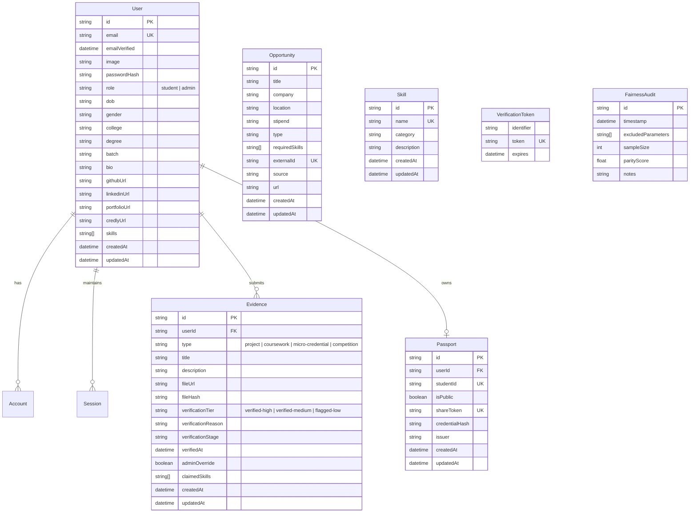

# SkillSync — Codebase Architecture & Component Reference Manual

> **SkillSync**: An automated, explainable, and bias-free talent verification and internship matching engine. Verifies coursework, projects, certifications, and credentials into a portable, cryptographically signed **Skill Passport**, and matches students with relevant opportunities without demographic bias.

---

## 1. System Overview & Technology Stack

SkillSync is built on a modern full-stack Next.js architecture with high-contrast UI design, hardware-accelerated animations, multi-factor credential verification, third-party certification integrations, sliding-window security rate limiting, and deterministic algorithmic matching.

### Core Technology Stack

* **Framework**: [Next.js 16 (App Router)](https://nextjs.org/) with React 19 (`react`, `react-dom`)
* **Styling & Design System**: [Tailwind CSS v4](https://tailwindcss.com/) with PostCSS (`@tailwindcss/postcss`) and `clsx` / `tailwind-merge`
* **Database & ORM**: PostgreSQL managed via [Prisma ORM](https://www.prisma.io/) (`@prisma/client`, `prisma`) with connection pooling & direct migration support
* **Authentication & Identity**: [NextAuth.js v5 Beta](https://authjs.dev/) (`next-auth`, `@auth/prisma-adapter`, `bcryptjs`) supporting Credentials, **GitHub OAuth**, **Google OAuth**, and **LinkedIn OAuth** with 12-round bcrypt password hashing
* **Email & Verification Service**: [Nodemailer](https://nodemailer.com/) with Gmail SMTP integration for 6-digit cryptographic OTP verification dispatch
* **Third-Party Integrations**:
  * **Credly**: Public Badge Registry JSON API integration with automated badge skill mapping and privacy detection
  * **LinkedIn**: Profile auto-sync, public credential verification, license import & avatar resolution
  * **GitHub**: Octokit repository analyzer, commit verification & avatar sync
* **State & Server Cache**: [TanStack React Query v5](https://tanstack.com/query/v5) (`@tanstack/react-query`) with automatic query invalidation cascades
* **Motion & Physics**: [Framer Motion 13](https://www.framer.com/motion/) (`framer-motion`)
* **Security & Threat Defense**: Sliding-window rate limiters, honeypot traps, path traversal defense, CORS-safe image proxying, and XSS sanitizers
* **Icons & Visuals**: [Lucide React](https://lucide.dev/) (`lucide-react`) and custom SVG vector brand icons (`GitHubIcon`, `LinkedInIcon`, `GoogleIcon`, `CredlyIcon`)
* **Data Visualization**: [Recharts](https://recharts.org/) (`recharts`)
* **Document Generation**: Custom high-fidelity streamable PDF engine generating cryptographically signed Skill Passport certificates
* **Verification Utilities**: [jsQR](https://github.com/cozmo/jsQR) for QR payload decoding and native Node.js `crypto` for SHA-256 Merkle root hashing
* **Curated Datasets**: Structured 1,526-skill canonical taxonomy and curated Indian Universities, Institutes of National Importance (IITs, NITs, IIITs, BITS, AIIMS, IIMs) and Degree programs

---

## 2. Complete Codebase Directory Structure

```text
skillsync/
├── app/                                # Next.js 16 App Router Directory
│   ├── (auth)/                         # Authentication Route Group
│   │   ├── forgot-password/
│   │   │   └── page.js                 # Password Reset Request Page
│   │   ├── reset-password/
│   │   │   └── page.js                 # Password Reset Form with Token Validation
│   │   ├── signin/
│   │   │   └── page.js                 # Sign In (Credentials, GitHub, Google & LinkedIn OAuth)
│   │   ├── signup/
│   │   │   └── page.js                 # Student Registration Page with OAuth Triggers
│   │   └── verify-email/
│   │       └── page.js                 # 6-Digit Email OTP Verification & Resend Console
│   ├── api/                            # Backend Serverless Route Handlers
│   │   ├── auth/
│   │   │   ├── [...nextauth]/route.js  # NextAuth v5 session handlers (OAuth & Credentials)
│   │   │   ├── forgot-password/route.js# Password reset token generation endpoint
│   │   │   ├── register/route.js       # Student account registration with OTP dispatch
│   │   │   ├── resend-verification/route.js # OTP resend dispatcher with rate limiting
│   │   │   ├── reset-password/route.js # Password reset execution endpoint
│   │   │   └── verify-email/route.js   # 6-Digit OTP token validator & activation
│   │   ├── credly/
│   │   │   ├── badges/route.js         # Credly public badge fetcher & privacy validator
│   │   │   └── import/route.js         # Credly badge import into evidence & passport
│   │   ├── cron/
│   │   │   └── ingest/route.js         # Multi-source opportunity scraper cron worker
│   │   ├── evidence/
│   │   │   └── route.js                # Evidence upload, deletion & verification pipeline
│   │   ├── github/
│   │   │   └── repos/route.js          # User GitHub repository retrieval via Octokit
│   │   ├── linkedin/
│   │   │   ├── certifications/route.js # LinkedIn certification lookup & manual badge entry
│   │   │   └── import/route.js         # LinkedIn certification import into passport
│   │   ├── opportunities/
│   │   │   ├── [id]/route.js           # Single opportunity & explainable match detail
│   │   │   └── route.js                # Opportunity feed with live match scores & deduplication
│   │   ├── passport/
│   │   │   ├── [shareToken]/route.js   # Public verifiable passport lookup
│   │   │   ├── pdf/route.js            # Verifiable PDF transcript certificate stream
│   │   │   └── route.js                # Authenticated user passport & visibility toggle
│   │   ├── profile/
│   │   │   ├── sync-avatar/route.js    # CORS-safe avatar sync from GitHub, LinkedIn, or URL
│   │   │   └── route.js                # Student profile data GET, PUT & account deletion
│   │   └── skills/
│   │       └── route.js                # Canonical 1,526-skill taxonomy autocomplete API
│   ├── components/                     # Reusable React UI & Feature Components
│   │   ├── auth/
│   │   │   └── AuthRequiredView.jsx    # Authentication required gatekeeper card
│   │   ├── evidence/
│   │   │   └── EvidenceCard.jsx        # Evidence item card with tier badge, hash & preview
│   │   ├── icons/                      # Custom Vector Icons & Wordmarks
│   │   │   ├── CredlyIcon.jsx          # Credly brand badge icon SVG
│   │   │   ├── DocumentIcon.jsx        # Verified credential document icon
│   │   │   ├── GenderIcon.jsx          # Demographic neutral gender icon
│   │   │   ├── GitHubIcon.jsx          # GitHub brand logo
│   │   │   ├── GoogleIcon.jsx          # Google multi-colored G logo SVG
│   │   │   ├── IndeedWordmark.jsx      # Indeed job portal wordmark
│   │   │   ├── LinkedInIcon.jsx        # LinkedIn brand icon
│   │   │   ├── LinkedInWordmark.jsx    # LinkedIn job portal wordmark
│   │   │   ├── MagnifyingGlassIcon.jsx # Magnifying glass lens SVG
│   │   │   ├── PassportWaves.jsx       # Luminous emerald vector watermark curves
│   │   │   ├── PortfolioIcon.jsx       # Personal portfolio link icon
│   │   │   └── index.js                # Centralized icon re-exports
│   │   ├── landing/
│   │   │   ├── FAQSection.jsx          # Interactive accordion FAQ with motion reveals
│   │   │   ├── FeatureBento.jsx        # Bento grid showcasing core platform pillars
│   │   │   ├── FinalCTA.jsx            # Conversion banner with rolling text buttons
│   │   │   ├── Hero.jsx                # Landing hero with animated cards & search preview
│   │   │   ├── Metrics.jsx             # Live impact statistics & verification metrics
│   │   │   ├── SmartAssist.jsx         # AI skill recommendation feature showcase
│   │   │   └── UseCaseTabs.jsx         # Persona walkthroughs (Students vs Employers)
│   │   ├── layout/
│   │   │   ├── Footer.jsx              # Global footer with navigation links & metadata
│   │   │   ├── HeaderNav.jsx           # Global navigation alias export
│   │   │   └── Navbar.jsx              # Sticky navigation with live auth, avatars & drawers
│   │   ├── opportunities/
│   │   │   ├── MatchExplanationCard.jsx# Explainable match breakdown & fairness callout
│   │   │   └── OpportunityCard.jsx     # Opportunity card with work mode & salary pills
│   │   ├── passport/
│   │   │   ├── InteractivePassportCard.jsx # 3D flippable emerald passport card & focus lightbox
│   │   │   ├── ShareExportButtons.jsx  # Export triggers (PDF, JSON, Public Link toggle)
│   │   │   ├── SkillEvidenceModal.jsx  # Skill evidence citation popover modal
│   │   │   └── SkillPassportFolder.jsx # 3D Confidential Folder envelope reveal interaction
│   │   ├── profile/
│   │   │   ├── AccountConnectModal.jsx # Third-party account connection modal (GH, IN, Credly)
│   │   │   ├── CertificateImportModal.jsx # Import modal for Credly & LinkedIn certifications
│   │   │   └── ImageCropperModal.jsx   # Interactive canvas-based avatar photo cropper
│   │   └── ui/
│   │       ├── AnimatedButton.jsx      # Rolling text interactive action button
│   │       ├── Badge.jsx               # 3-tier verification badge & status pills
│   │       ├── ClickSpark.jsx          # Particle spark effect on user clicks
│   │       ├── DatePickerFlyout.jsx    # Interactive calendar date picker flyout
│   │       ├── FadeIn.jsx              # Framer Motion scroll entrance wrappers
│   │       ├── MagnifyingEvidence.jsx  # Animated magnifying glass micro-interaction
│   │       ├── RollingText.jsx         # Kinetic letter-flipping text effect
│   │       └── SearchableDropdown.jsx  # Searchable dropdown for institutions & degrees with NIRF
│   ├── dashboard/                      # Student Dashboard
│   │   ├── evidence/
│   │   │   └── new/page.js             # Evidence submission form & GitHub selector
│   │   └── page.js                     # Student credential summary & evidence repository
│   ├── data/                           # Canonical Datasets & Static Content
│   │   ├── raw/
│   │   │   └── student_intern_skills.csv # Raw canonical skill taxonomy dataset
│   │   ├── institutionsAndDegrees.js   # Curated Indian universities, IITs, NITs & degree programs
│   │   ├── mockData.js                 # Fallback mock records for demo & offline modes
│   │   ├── skillsyncData.js            # Platform metadata, FAQ, and feature lists
│   │   └── studentInternSkills.js      # Structured 1,526 student skills taxonomy
│   ├── docs/                           # Documentation Portal
│   │   ├── BUILD_LOG.md                # Codebase architecture & component reference manual
│   │   ├── DESIGN_DOC.md               # Design token & aesthetic specification
│   │   ├── MATCH_ENGINE_SPECIFICATION.md # Algorithmic matching & fairness math spec
│   │   └── page.js                     # In-app interactive documentation center
│   ├── hooks/                          # Custom Client React Hooks
│   │   └── useAuth.js                  # Client authentication status & session state
│   ├── opportunities/                  # Opportunities Feed & Matching
│   │   ├── [id]/
│   │   │   └── page.js                 # Opportunity detail & match breakdown centerpiece
│   │   └── page.js                     # Live internship feed with match filters
│   ├── passport/                       # Skill Passport Views
│   │   ├── [shareToken]/
│   │   │   └── page.js                 # Public shareable passport verification view
│   │   └── page.js                     # Authenticated student Skill Passport manager
│   ├── privacy/
│   │   └── page.js                     # Privacy policy & zero-demographic-bias terms
│   ├── profile/
│   │   └── page.js                     # Bento layout profile editor, connections & certificate import
│   ├── support/
│   │   └── page.js                     # Help center, FAQs, and support contact form
│   ├── terms/
│   │   └── page.js                     # Terms of service & verification guidelines
│   ├── globals.css                     # Global Tailwind styling, theme tokens & keyframes
│   ├── layout.js                       # Root HTML/Body layout with Geist fonts & providers
│   ├── page.js                         # Public landing page composition
│   ├── providers.js                    # SessionProvider, React Query & ClickSpark wrappers
│   └── template.js                     # Route transition wrapper
├── lib/                                # Core Business Logic, Services & Utilities
│   ├── config/
│   │   └── env.js                      # Centralized environment variable resolver & validator
│   ├── email/
│   │   └── mailer.js                   # Nodemailer SMTP transporter & branded OTP email templates
│   ├── external/
│   │   └── clients.js                  # Supabase & Octokit client factories
│   ├── ingestion/                      # Multi-Source Job Scraper Adapters
│   │   ├── arbeitnow.js                # Arbeitnow remote job API adapter
│   │   ├── indeed.js                   # Indeed job aggregator & feed scraper
│   │   ├── jobicy.js                   # Jobicy tech internship scraper
│   │   ├── linkedin.js                 # LinkedIn live job scraper adapter
│   │   ├── normalize.js                # Unified opportunity schema normalizer
│   │   └── remotive.js                 # Remotive software engineering jobs adapter
│   ├── integrations/                   # Third-Party Credential & Certificate Integrations
│   │   ├── credly.js                   # Credly public badge registry fetcher, parser, skill extractor & issuer mapping
│   │   └── linkedin.js                 # LinkedIn profile parser, certification validator & avatar resolver
│   ├── matching/                       # Algorithmic Match Engine & Fairness
│   │   ├── config.js                   # Match weights, thresholds, and tier coefficients
│   │   ├── explainability.js           # Explainable match reason generation & citations
│   │   ├── getMatchingFeatures.js      # Student competency feature extraction & demographic scrubbing
│   │   ├── jobParser.js                # Job requirements extraction & confidence scoring
│   │   ├── scoring.js                  # Bias-free deterministic match scoring
│   │   └── taxonomy.js                 # Skill alias normalization & strict incompatibilities
│   ├── opportunities/
│   │   ├── opportunityService.js       # Database opportunity queries, scraping cache & feed orchestration
│   │   └── workModeUtils.js            # Work mode classifier, stipend standardizer & deduplication
│   ├── security/                       # Application Security & Threat Mitigation
│   │   ├── botProtection.js            # User agent scanner detection & honeypot traps
│   │   ├── logger.js                   # Structured security audit logger with data redaction
│   │   ├── password.js                 # NIST-compliant password validation & 12-round bcrypt
│   │   ├── rateLimit.js                # Memory-efficient sliding-window rate limiters
│   │   ├── tokens.js                   # 6-digit OTP generator & 64-char crypto tokens
│   │   └── validator.js                # XSS sanitizers, path traversal defense, file validators
│   ├── verification/                   # Automated Multi-Stage Verification Pipeline
│   │   ├── cryptoHash.js               # SHA-256 cryptographic Merkle root hasher
│   │   ├── githubCheck.js              # GitHub repository & commit verification
│   │   ├── ocrParser.js                # Document OCR text extraction parser
│   │   ├── pipeline.js                 # Verification orchestrator across stages
│   │   └── qrVerifier.js               # Cryptographic QR payload validator
│   ├── auth.js                         # NextAuth v5 configuration, credentials, Google/GitHub/LinkedIn OAuth
│   ├── prisma.js                       # Prisma Client singleton connection
│   └── utils.js                        # Tailwind class merge (`cn`) utility
├── prisma/
│   ├── schema.prisma                   # PostgreSQL database schema & relational models
│   └── seed.js                         # Database seeder for demo accounts & skill taxonomy
├── tests/                              # Automated Test Suite (64 Automated Unit Tests)
│   ├── env.test.mjs                    # Environment & Database Resolution Tests (9 cases)
│   ├── integrations.test.mjs           # Credly, LinkedIn & Opportunity Integrity Tests (17 cases)
│   ├── matching.test.mjs               # Match engine & fairness unit tests (12 cases)
│   └── security.test.mjs               # Auth, security, IDOR, & rate limiting tests (26 cases)
├── public/                             # Static Assets (Logos, SVGs, Images)
├── .env.example                        # Environment variable documentation template
├── next.config.mjs                     # Next.js build configuration & external image hosts
├── package.json                        # Project dependencies and npm scripts
├── postcss.config.mjs                  # PostCSS plugins configuration
└── proxy.js                            # Local development API proxy
```

---

## 3. Exhaustive Component Catalog & Usage Directory

Every component in SkillSync is built for modularity, accessibility, and high visual polish. Below is the complete catalog explaining each component's architecture, props, and exact usage locations.

```text
+----------------------------------------------------------------------------------------------------+
|                                    SKILLSYNC COMPONENT TREE                                        |
+----------------------------------------------------------------------------------------------------+
|                                                                                                    |
|  [Root Layout / Providers] (layout.js, providers.js, template.js)                                  |
|  ├── ClickSpark (Canvas Particle Sparks)                                                           |
|  └── Global Navbar (Navbar.jsx / HeaderNav.jsx)                                                    |
|                                                                                                    |
|  [Landing Page] (app/page.js)                                                                      |
|  ├── Hero.jsx (MagnifyingEvidence, RollingText, FadeIn, FadeInStagger)                             |
|  ├── FeatureBento.jsx (Badge, FadeIn)                                                              |
|  ├── UseCaseTabs.jsx (RollingText, FadeIn)                                                         |
|  ├── Metrics.jsx (Recharts, FadeIn)                                                                |
|  ├── SmartAssist.jsx (RollingText, FadeIn)                                                         |
|  ├── FAQSection.jsx (RollingText, FadeIn, FadeInStagger)                                            |
|  └── FinalCTA.jsx (RollingText, FadeIn)                                                            |
|                                                                                                    |
|  [Student Dashboard] (app/dashboard/page.js, app/dashboard/evidence/new/page.js)                   |
|  ├── AuthRequiredView.jsx                                                                          |
|  ├── EvidenceCard.jsx (Badge, RollingText, Cryptographic Hash)                                     |
|  └── GitHub Repo Selector & Evidence Upload Form (Badge, studentInternSkills)                      |
|                                                                                                    |
|  [Opportunities Engine] (app/opportunities/page.js, app/opportunities/[id]/page.js)                |
|  ├── AuthRequiredView.jsx                                                                          |
|  ├── OpportunityCard.jsx (Work Mode Pill, Standardized Stipend, Match Score Badge)                 |
|  └── MatchExplanationCard.jsx (Badge, Supporting Evidence, Missing Skills, Direct Apply Actions)   |
|                                                                                                    |
|  [Skill Passport] (app/passport/page.js, app/passport/[shareToken]/page.js)                        |
|  ├── AuthRequiredView.jsx                                                                          |
|  ├── SkillPassportFolder.jsx (3D Confidential Folder reveal envelope)                             |
|  │   └── InteractivePassportCard.jsx (Luminous 3D Flip, Lightbox, Merkle Hash, Touch Support)     |
|  │       └── SkillEvidenceModal.jsx (Badge, Evidence Citations)                                    |
|  └── ShareExportButtons.jsx (RollingText, PDF Stream, Public Toggle)                               |
|                                                                                                    |
|  [Profile Editor & Integrations] (app/profile/page.js)                                             |
|  ├── AuthRequiredView.jsx                                                                          |
|  ├── Bento Layout Grid (Academic, Social, Competencies, Account Actions)                           |
|  ├── AccountConnectModal.jsx (GitHub, LinkedIn, Credly, Portfolio)                                 |
|  ├── CertificateImportModal.jsx (Credly & LinkedIn Certifications Importer)                        |
|  ├── ImageCropperModal.jsx (HTML5 Canvas Zoom/Pan/Rotate + Avatar Sync)                            |
|  ├── SearchableDropdown.jsx (National Universities, IITs/NITs, Degree Programs)                   |
|  └── DatePickerFlyout.jsx (Interactive Calendar Date Picker)                                       |
|                                                                                                    |
|  [Global Footer] (Footer.jsx)                                                                      |
+----------------------------------------------------------------------------------------------------+
```

---

### 3.1. Layout & Navigation Components

#### 1. `Navbar.jsx`
* **File Path**: `app/components/layout/Navbar.jsx`
* **Purpose**: Primary global navigation header. Displays brand logo, navigation links (`Dashboard`, `Skill Passport`, `Opportunities`, `Profile`, `Docs`), live authentication status, user avatar, and session management.
* **Props & State**:
  * Consumes `useSession()` and `signOut()` from `next-auth/react`.
  * `mobileMenuOpen` (`boolean`): Controls mobile drawer toggle.
  * `userDropdownOpen` (`boolean`): Toggles user avatar popup menu.
* **Key Features**:
  * Responsive layout with full mobile slide-out overlay.
  * Active route indicator matching the current URL pathname.
  * Dynamic auth state: renders Sign In / Register buttons for guests, or student avatar with role badge for authenticated sessions.
  * Displays synchronized avatar from GitHub, LinkedIn, Google, or custom upload.
* **Where It Is Used**:
  * `app/page.js`, `app/(auth)/*`, `app/dashboard/page.js`, `app/opportunities/page.js`, `app/passport/page.js`, `app/profile/page.js`, `app/docs/page.js`, `app/components/layout/HeaderNav.jsx`

#### 2. `HeaderNav.jsx`
* **File Path**: `app/components/layout/HeaderNav.jsx`
* **Purpose**: Convenience wrapper and alias exporting `Navbar` for unified layout inclusion.

#### 3. `Footer.jsx`
* **File Path**: `app/components/layout/Footer.jsx`
* **Purpose**: Global application footer providing categorized sitemaps, brand info, copyright, system status indicators, and legal links.

---

### 3.2. Authentication & Gatekeeping Components

#### 4. `AuthRequiredView.jsx`
* **File Path**: `app/components/auth/AuthRequiredView.jsx`
* **Purpose**: Standardized, high-aesthetic security gatekeeper card displayed whenever an unauthenticated visitor attempts to access protected student features.

---

### 3.3. Profile, Integrations & Certificate Import Components

#### 5. `AccountConnectModal.jsx`
* **File Path**: `app/components/profile/AccountConnectModal.jsx`
* **Purpose**: Multi-provider modal for connecting, verifying, and managing third-party developer profiles and credential sources (**GitHub**, **LinkedIn**, **Credly**, and **Portfolio**).
* **Props**:
  * `isOpen` (`boolean`): Controls modal visibility.
  * `onClose` (`function`): Dismisses the modal.
  * `provider` (`"github" | "linkedin" | "credly" | "portfolio"`): Specifies the provider being managed.
  * `currentUrl` (`string`): Existing linked URL or handle.
  * `onSaveSuccess` (`function(updatedProfile)`): Callback invoked after successful database persistence.
* **Key Features**:
  * **Provider-Specific Branded Theming**: Custom badges, brand icons, and color palettes for GitHub, LinkedIn, Credly, and Portfolio.
  * **Automatic URL Formatting**: Intelligently parses raw handles or full URLs into canonical links.
  * **One-Click OAuth Trigger**: Direct triggers for GitHub and LinkedIn OAuth sign-in and account linking.
  * **Disconnect Action**: Self-service disconnect button with immediate state sync.
* **Where It Is Used**:
  * `app/profile/page.js` (Invoked from Social Accounts Bento grid)

#### 6. `CertificateImportModal.jsx`
* **File Path**: `app/components/profile/CertificateImportModal.jsx`
* **Purpose**: Dedicated credential importer allowing students to search, select, preview, and bulk-import verified certifications from **Credly** and **LinkedIn** directly into their Evidence repository and Skill Passport.
* **Props**:
  * `isOpen` (`boolean`): Modal visibility state.
  * `onClose` (`function`): Dismiss callback.
  * `provider` (`"credly" | "linkedin"`): Active provider tab.
  * `initialUrl` (`string`): Pre-filled handle or URL from user profile.
  * `onImportSuccess` (`function(importedRecords)`): Callback when certificates are saved.
* **Key Features**:
  * **Live Fetch & Validation**: Communicates with `/api/credly/badges` and `/api/linkedin/certifications`.
  * **Privacy Guard**: Identifies private Credly profiles and instructs user on public visibility settings.
  * **Skill Extraction**: Automatically tags verified skills from badge and certificate metadata.
  * **Multi-Select & Bulk Import**: Allows importing single or multiple credentials in a single operation, automatically setting `verified-high` verification tier.
* **Where It Is Used**:
  * `app/profile/page.js` (Invoked via "Import Certifications" action banner)

#### 7. `SearchableDropdown.jsx`
* **File Path**: `app/components/ui/SearchableDropdown.jsx`
* **Purpose**: High-performance searchable dropdown component designed for selecting verified Colleges/Universities and Degrees from a curated national dataset.
* **Props**:
  * `options` (`Array<string | object>`): Array of option items (from `institutionsAndDegrees.js`).
  * `value` (`string`): Current selected value.
  * `onChange` (`function(selectedVal)`): Callback when an item is selected or custom string typed.
  * `placeholder` (`string`): Search placeholder text.
  * `iconType` (`"building" | "degree"`): Selects Building icon (for colleges) or GraduationCap icon (for degrees).
  * `className` (`string`): Additional CSS class styling.
* **Key Features**:
  * Full keyboard navigation (Up/Down arrows, Enter, Escape).
  * Rich metadata display (NIRF ranking badges, state, city, institute category).
  * Custom entry fallback for unlisted institutions.
* **Where It Is Used**:
  * `app/profile/page.js` (College / University & Degree selection inputs)

#### 8. `ImageCropperModal.jsx`
* **File Path**: `app/components/profile/ImageCropperModal.jsx`
* **Purpose**: Canvas-based interactive image cropping modal for student profile avatars with pan, zoom, rotate, and circular/square mask toggles.
* **Where It Is Used**:
  * `app/profile/page.js` (Profile Photo Editor)

#### 9. `DatePickerFlyout.jsx`
* **File Path**: `app/components/ui/DatePickerFlyout.jsx`
* **Purpose**: Interactive calendar date picker flyout with dropdown jump selectors for fast Date of Birth (DOB) entry.
* **Where It Is Used**:
  * `app/profile/page.js` (Date of Birth Field)

---

### 3.4. Interactive Skill Passport & Verifiable Credential Components

#### 10. `SkillPassportFolder.jsx`
* **File Path**: `app/components/passport/SkillPassportFolder.jsx`
* **Purpose**: 3D "Confidential Folder" envelope interaction that houses the landscape Skill Passport card.
* **Where It Is Used**:
  * `app/passport/page.js` (Student Passport Portal)
  * `app/passport/[shareToken]/page.js` (Public Verifiable Passport View)

#### 11. `InteractivePassportCard.jsx`
* **File Path**: `app/components/passport/InteractivePassportCard.jsx`
* **Purpose**: The flagship visual component of the platform. A 3D flippable, emerald-themed verifiable credential card representing verified skills, projects, institutional credentials, and cryptographic Merkle root hash with mobile-responsive touch gestures and QR rendering.
* **Where It Is Used**:
  * `SkillPassportFolder.jsx`, `passport/page.js`, `passport/[shareToken]`

#### 12. `SkillEvidenceModal.jsx`
* **File Path**: `app/components/passport/SkillEvidenceModal.jsx`
* **Purpose**: Rich glassmorphic popover modal rendered when a user hovers over a skill badge on the Skill Passport card.
* **Where It Is Used**:
  * `InteractivePassportCard.jsx` (Sub-component for skill badge citations)

#### 13. `ShareExportButtons.jsx`
* **File Path**: `app/components/passport/ShareExportButtons.jsx`
* **Purpose**: Passport export and sharing toolbar (PDF certificate download, JSON-LD export, public sharing URL generation, and privacy toggle).
* **Where It Is Used**:
  * `app/passport/page.js` (Skill Passport Toolbar)

---

### 3.5. Opportunities & Matching Components

#### 14. `OpportunityCard.jsx`
* **File Path**: `app/components/opportunities/OpportunityCard.jsx`
* **Purpose**: Card component for internship and job opportunities in the feed featuring standardized work mode badges, clean stipend displays, and match score pills.
* **Where It Is Used**:
  * `app/opportunities/page.js` (Live Opportunities Explorer Feed)

#### 15. `MatchExplanationCard.jsx`
* **File Path**: `app/components/opportunities/MatchExplanationCard.jsx`
* **Purpose**: Explainable Match Engine centerpiece displayed on opportunity detail pages. Explains *why* the student received their match score by citing verified evidence and highlighting missing skills.
* **Where It Is Used**:
  * `app/opportunities/[id]/page.js` (Opportunity Match Detail Centerpiece)

---

### 3.6. Evidence & UI Primitive Components

#### 16. `EvidenceCard.jsx`
* **File Path**: `app/components/evidence/EvidenceCard.jsx`
* **Purpose**: Renders an individual verified evidence item (project, coursework, credential, competition) in the student repository.
* **Where It Is Used**:
  * `app/dashboard/page.js` (Student Evidence Repository)

#### 17. `Badge.jsx`
* **File Path**: `app/components/ui/Badge.jsx`
* **Purpose**: Standardized 3-tier verification badge and status pill component (`verified-high`, `verified-medium`, `flagged-low`).

#### 18. `AnimatedButton.jsx`, `RollingText.jsx`, `ClickSpark.jsx`, `FadeIn.jsx`, `MagnifyingEvidence.jsx`
* **File Paths**: `app/components/ui/*.jsx`
* **Purpose**: Motion & physics primitives providing kinetic typography, canvas click sparks, staggered reveals, and interactive micro-animations.

---

### 3.7. Custom Vector Icons & Wordmarks (`app/components/icons/`)

| Icon Component | File Location | Purpose & Branding |
| :--- | :--- | :--- |
| `GitHubIcon` | `app/components/icons/GitHubIcon.jsx` | GitHub brand silhouette for OAuth and repo linking |
| `LinkedInIcon` | `app/components/icons/LinkedInIcon.jsx` | Official LinkedIn blue badge icon |
| `GoogleIcon` | `app/components/icons/GoogleIcon.jsx` | Official 4-color Google G logo for Google OAuth |
| `CredlyIcon` | `app/components/icons/CredlyIcon.jsx` | Credly orange hexagon badge icon |
| `IndeedWordmark` | `app/components/icons/IndeedWordmark.jsx` | Indeed blue typography wordmark |
| `LinkedInWordmark` | `app/components/icons/LinkedInWordmark.jsx` | LinkedIn typography wordmark |
| `DocumentIcon` | `app/components/icons/DocumentIcon.jsx` | Verified document credential vector |
| `PassportWaves` | `app/components/icons/PassportWaves.jsx` | Luminous emerald curved watermark vector |
| `PortfolioIcon` | `app/components/icons/PortfolioIcon.jsx` | Developer portfolio vector icon |
| `GenderIcon` | `app/components/icons/GenderIcon.jsx` | Demographic-neutral profile icon |
| `MagnifyingGlassIcon` | `app/components/icons/MagnifyingGlassIcon.jsx` | Magnifying lens micro-interaction vector |

---

## 4. App Router Pages & Application Routing Structure

| Route Path | File Location | Access Level | Description & Core Features |
| :--- | :--- | :--- | :--- |
| `/` | `app/page.js` | Public | **Platform Landing Page**: Hero, FeatureBento, UseCaseTabs, Metrics, SmartAssist, FAQSection, FinalCTA, Footer. |
| `/signin` | `app/(auth)/signin/page.js` | Public (Guest) | **Sign In Page**: Email/Password login, GitHub OAuth, Google OAuth, LinkedIn OAuth buttons. |
| `/signup` | `app/(auth)/signup/page.js` | Public (Guest) | **Student Registration**: Creates account, triggers 6-digit OTP verification dispatch via email. |
| `/verify-email` | `app/(auth)/verify-email/page.js` | Public | **Email OTP Verification**: 6-digit cryptographic OTP code entry, countdown resend timer, account activation. |
| `/forgot-password` | `app/(auth)/forgot-password/page.js` | Public (Guest) | **Password Recovery**: Dispatches secure time-limited password reset tokens. |
| `/reset-password` | `app/(auth)/reset-password/page.js` | Public (Guest) | **Password Reset Form**: Validates reset token and enforces NIST password complexity. |
| `/dashboard` | `app/dashboard/page.js` | Protected | **Student Dashboard**: Verified skill counts, evidence repository (`EvidenceCard`), and passport preview. |
| `/dashboard/evidence/new` | `app/dashboard/evidence/new/page.js` | Protected | **Evidence Upload**: Form for uploading coursework, certificates, or selecting connected GitHub repositories. |
| `/opportunities` | `app/opportunities/page.js` | Public / Auth | **Opportunities Feed**: Filterable directory of internships with live match percentage pills & standardized stipends. |
| `/opportunities/[id]` | `app/opportunities/[id]/page.js` | Public / Auth | **Opportunity Detail & Match Breakdown**: Displays role details and the centerpiece `MatchExplanationCard`. |
| `/passport` | `app/passport/page.js` | Protected | **Skill Passport Portal**: Interactive 3D folding passport manager (`SkillPassportFolder`, `InteractivePassportCard`). |
| `/passport/[shareToken]` | `app/passport/[shareToken]/page.js` | Public | **Public Verifiable Passport**: External URL for recruiters to inspect verified proof and cryptographic SHA-256 Merkle root. |
| `/profile` | `app/profile/page.js` | Protected | **Student Profile Console**: Modern Bento layout, Account Connections modal, Certificate Import modal, Avatar sync, `SearchableDropdown` institutions & degrees, and account deletion. |
| `/docs` | `app/docs/page.js` | Public | **Documentation Center**: In-app architectural guide, API docs, and verification standards. |
| `/privacy` | `app/privacy/page.js` | Public | **Privacy Policy**: Zero-bias data handling, demographic parameter exclusion, and cryptographic hashing disclosure. |
| `/terms` | `app/terms/page.js` | Public | **Terms of Service**: Acceptable use, verification honesty, and credential portability terms. |
| `/support` | `app/support/page.js` | Public | **Support Portal**: Help center articles, contact support form, and FAQs. |

---

## 5. API Routes & Serverless Backend Endpoints

SkillSync implements RESTful Next.js Route Handlers with session validation, error boundaries, rate limiting, and Prisma transactions:

### 5.1. Authentication & Account Security
* **`POST /api/auth/register`** (`app/api/auth/register/route.js`): Validates email, enforces strong password complexity, hashes password via 12-round bcrypt, generates a 6-digit OTP, dispatches email via Nodemailer, and auto-provisions a `Passport` record.
* **`POST /api/auth/verify-email`** (`app/api/auth/verify-email/route.js`): Validates 6-digit OTP code against `VerificationToken` table and sets `emailVerified` timestamp.
* **`POST /api/auth/resend-verification`** (`app/api/auth/resend-verification/route.js`): Dispatches a new 6-digit OTP with sliding-window rate limit protection.
* **`POST /api/auth/forgot-password`** (`app/api/auth/forgot-password/route.js`): Generates a secure 64-character token with 1-hour expiry.
* **`POST /api/auth/reset-password`** (`app/api/auth/reset-password/route.js`): Validates token and updates user password hash.
* **`GET/POST /api/auth/[...nextauth]`** (`app/api/auth/[...nextauth]/route.js`): NextAuth v5 session handler for Credentials, GitHub, Google, and LinkedIn OAuth.

### 5.2. Profile & Avatar Management
* **`GET /api/profile`** (`app/api/profile/route.js`): Returns student profile data, skills array, gender, DOB, college, degree, batch, and connected account URLs.
* **`PUT /api/profile`** (`app/api/profile/route.js`): Updates profile details, sanitizes input data, and merges newly claimed skills.
* **`DELETE /api/profile`** (`app/api/profile/route.js`): Self-service GDPR-compliant account deletion cascading across all user relations.
* **`POST /api/profile/sync-avatar`** (`app/api/profile/sync-avatar/route.js`): Fetches public profile pictures from GitHub, LinkedIn, or custom URLs and converts them into CORS-safe base64 data URLs for client canvas cropping.

### 5.3. Third-Party Integrations & Certificate Import
* **`GET /api/credly/badges`** (`app/api/credly/badges/route.js`): Queries Credly public badge registry for user handle or badge ID, validates public visibility, and maps badge skills.
* **`POST /api/credly/import`** (`app/api/credly/import/route.js`): Imports Credly digital badges into Evidence (`verified-high` tier) with cryptographic verification citations.
* **`GET /api/linkedin/certifications`** (`app/api/linkedin/certifications/route.js`): Fetches accredited certifications or verifies digital badge URLs from LinkedIn.
* **`POST /api/linkedin/import`** (`app/api/linkedin/import/route.js`): Imports verified LinkedIn licenses and certifications into student evidence.
* **`GET /api/github/repos`** (`app/api/github/repos/route.js`): Retrieves user's linked GitHub repositories via Octokit for project evidence linking.

### 5.4. Student Evidence & Verification Pipeline
* **`GET /api/evidence`** (`app/api/evidence/route.js`): Retrieves all evidence records submitted by the authenticated student.
* **`POST /api/evidence`** (`app/api/evidence/route.js`): Runs evidence through `runVerificationPipeline()`, computes SHA-256 hash, and syncs claimed skills into the user's Passport.
* **`DELETE /api/evidence`** (`app/api/evidence/route.js`): IDOR-protected endpoint to delete user evidence and recalculate passport credentials.
* **`GET /api/skills`** (`app/api/skills/route.js`): Fast autocomplete API searching across all 1,526 curated student skills with category filtering.

### 5.5. Skill Passport & Verifiable Credentials
* **`GET /api/passport`** (`app/api/passport/route.js`): Fetches authenticated student's passport, aggregating verified skills, projects, and SHA-256 Merkle root hash.
* **`PUT /api/passport`** (`app/api/passport/route.js`): Updates passport privacy settings (toggles `isPublic` flag).
* **`GET /api/passport/[shareToken]`** (`app/api/passport/[shareToken]/route.js`): Public lookup endpoint returning verified credential data for a given `shareToken`.
* **`GET /api/passport/pdf`** (`app/api/passport/pdf/route.js`): Generates and streams an official cryptographic PDF Certificate with QR verification stamp and Merkle digest.

### 5.6. Opportunities & Matching Engine
* **`GET /api/opportunities`** (`app/api/opportunities/route.js`): Queries opportunities with in-memory scraping caching, applies `workModeUtils` deduplication, standardizes stipends, and calculates real-time bias-free match scores.
* **`GET /api/opportunities/[id]`** (`app/api/opportunities/[id]/route.js`): Returns detailed opportunity data alongside complete explainable match breakdown.
* **`GET /api/cron/ingest`** (`app/api/cron/ingest/route.js`): Scraper cron worker ingesting internships from LinkedIn, Indeed, Remotive, Arbeitnow, and Jobicy.

---

## 6. Core Business Logic, Security & Matching (`lib/`)

```text
lib/
├── config/
│   └── env.js                      # Environment configuration & multi-variable resolver
├── email/
│   └── mailer.js                   # Nodemailer transporter & OTP email templates
├── external/
│   └── clients.js                  # Supabase & Octokit client factories
├── ingestion/                      # Multi-source job scraper adapters
│   ├── arbeitnow.js, indeed.js, jobicy.js, linkedin.js, remotive.js
│   └── normalize.js                # Canonical opportunity schema normalizer
├── integrations/                   # Third-Party Credential & Certificate Integrations
│   ├── credly.js                   # Credly public badge registry fetcher, parser & skill extractor
│   └── linkedin.js                 # LinkedIn profile parser, badge validator & avatar sync
├── matching/                       # Deterministic Match Engine
│   ├── config.js                   # Match weights, thresholds, and tier coefficients
│   ├── explainability.js           # Natural language match justification generator
│   ├── getMatchingFeatures.js      # Student competency feature extraction & zero-bias scrub
│   ├── jobParser.js                # Job requirements extraction & confidence scoring
│   ├── scoring.js                  # Bias-free deterministic match scoring
│   └── taxonomy.js                 # Skill alias normalization & strict incompatibilities
├── opportunities/
│   ├── opportunityService.js       # Database opportunity query service & scraper cache
│   └── workModeUtils.js            # Work mode classifier, stipend standardizer & deduplicator
├── security/                       # Application Security & Threat Defense
│   ├── botProtection.js            # User agent scanner detection & honeypot traps
│   ├── logger.js                   # Structured security audit logger with data redaction
│   ├── password.js                 # NIST password validation & 12-round bcrypt
│   ├── rateLimit.js                # Memory-efficient sliding-window rate limiters
│   ├── tokens.js                   # 6-digit OTP generator & 64-char crypto token generator
│   └── validator.js                # XSS sanitizers, path traversal defense, file validators
├── verification/                   # Automated 3-Stage Verification Pipeline
│   ├── cryptoHash.js               # SHA-256 Merkle root cryptographic hasher
│   ├── githubCheck.js              # GitHub repository & commit verification
│   ├── ocrParser.js                # Document OCR text extraction parser
│   ├── pipeline.js                 # Verification orchestrator
│   └── qrVerifier.js               # Cryptographic QR payload validator
├── auth.js                         # NextAuth v5 configuration, credentials & OAuth providers
├── prisma.js                       # Prisma Client singleton
└── utils.js                        # Tailwind class merge helper (`cn`)
```

### 6.1. Verification Pipeline (`lib/verification/`)
* **`pipeline.js`**: Orchestrates multi-factor verification across three stages:
  1. **Stage 1 (QR Verification)**: Validates institutional QR signatures and registry URLs via `qrVerifier.js`.
  2. **Stage 2 (GitHub Verification)**: Uses `githubCheck.js` to inspect repository existence, commit author matching, and detected programming languages.
  3. **Stage 3 (OCR Extraction)**: Uses `ocrParser.js` to extract certificate text and cross-reference student name and completion dates.
  4. **Cryptographic Hashing**: Computes a SHA-256 hash (`cryptoHash.js`) representing the tamper-proof Merkle root of the credential.

### 6.2. Algorithmic Matching & Fairness Guarantee (`lib/matching/`)
* **`scoring.js`**: Computes compatibility scores strictly based on **Skill Alignment & Verification Tier**:
  $$\text{Match Score} = (0.60 \times S_{\text{required}}) + (0.15 \times S_{\text{title}}) + (0.10 \times S_{\text{preferred}}) + (0.10 \times S_{\text{experience}}) + (0.05 \times S_{\text{education}})$$
  * **Verified High Tier**: $1.0\times$ multiplier
  * **Verified Medium Tier**: $0.85\times$ multiplier
  * **Flagged Low Tier**: $0.50\times$ multiplier
* **Strict Incompatibility & Anti-False-Positive Engine (`taxonomy.js`)**: Prevents false positive cross-matches (e.g. `Java != JavaScript`, `C != C++`, `React != React Native`, `AWS != Azure`).
* **Zero-Bias Exclusion Guarantee**: Explicitly removes demographic variables from ranking algorithms:
  ```javascript
  const EXCLUDED_DEMOGRAPHIC_PARAMETERS = [
    "gender",
    "college_tier",
    "name",
    "photo",
    "ethnicity",
    "age"
  ];
  ```

---

## 7. Database Schema & Relational Models (`prisma/schema.prisma`)



---

## 8. Automated Test Suite (`tests/`)

SkillSync includes a comprehensive unit test suite (`npm test`) executing **64 automated test cases across 4 test suites with 100% pass rate**:

### 1. Environment & Database Resolution Suite (`tests/env.test.mjs` — 9 Tests)
* Database connection candidate prioritization (`STORAGE_POSTGRES_PRISMA_URL` $\to$ `DATABASE_URL`).
* URL synthesis from individual connection parameters (`USER`, `HOST`, `PASSWORD`, `DATABASE`).
* Direct unpooled database URL resolution for migrations.
* Supabase configuration resolution (Service Role, Anon, Publishable, JWT secret).
* Backward compatibility for standard `DATABASE_URL` and `SUPABASE_*` environment variables.

### 2. Authentication & Security Suite (`tests/security.test.mjs` — 26 Tests)
* Password policy validation (length, character classes, DoS size limit).
* 12-round bcrypt hash creation and matching.
* Sliding-window rate limiter quota enforcement and window resets.
* Cryptographically secure 64-character hex token generation.
* Backdoor password elimination and legacy credential rejection.
* IDOR ownership predicates for evidence and private passport lookups.
* Structured security logger with sensitive field redaction (`password`, `token`, `secret`).
* Malicious bot and vulnerability scanner detection (`sqlmap`, `nikto`, `python-requests`).
* Path traversal and restricted route probe defense (`/.env`, `/.git`).
* Hidden honeypot form validation.
* XSS script sanitization, null-byte stripping, and strict RFC 5322 email validation.
* File upload extension whitelisting and MIME type size constraints.

### 3. Job Match Score Engine Suite (`tests/matching.test.mjs` — 12 Tests)
* High-confidence core stack match calculation ($\ge 88\%$).
* Completely mismatched technology stack detection ($\le 35\%$).
* Partial skill match scoring and missing tool identification.
* Semantic related skill credit (e.g. `PostgreSQL` satisfying `SQL`).
* Strict incompatibility anti-false-positive engine (`JavaScript != Java`, `C != C++`).
* Fresher experience compatibility (0–2 yrs junior role full scoring).
* Senior role experience penalty for fresher candidates.
* Keyword inflation defense (repeated terms do not multiply score).
* Match confidence scoring for rich vs sparse job descriptions.
* Determinism & Zero Demographic Bias certification.
* Canonical skill alias normalization.
* Natural language explainability breakdown and citation generation.

### 4. Credly, LinkedIn & Opportunity Integrity Suite (`tests/integrations.test.mjs` — 17 Tests)
* Skill keyword extractor identifying technical competencies from metadata.
* LinkedIn and GitHub profile username extractors.
* LinkedIn digital badge and custom certification verifiers.
* LinkedIn custom certification preservation of custom issuers and skill tagging.
* Credly badge ID, username handle, and short URL parser.
* Credly AWS digital badge verification directly into `verified-high` tier.
* Credly Azure and GCP digital badge verification.
* Credly empty input prompt handling.
* Credly private profile detection and security boundary handling.
* QR code verifiers for digital badges and university registrar portals.
* Deterministic SHA-256 cryptographic evidence digest calculation.
* Salary and compensation standardizer formatting strings and number ranges.
* Opportunity deduplication across IDs, URLs, and Title+Company signatures.
* Opportunity validator guaranteeing data integrity, workMode, and clean skills.

---

## 9. Component Cross-Reference & Usages Matrix

| Component Name | Category | Primary Purpose | Directly Imported & Consumed By |
| :--- | :--- | :--- | :--- |
| `Navbar` | Layout | Global sticky header & navigation | All App Router Pages, `HeaderNav.jsx` |
| `HeaderNav` | Layout | Navigation alias | Layout wrappers |
| `Footer` | Layout | Global footer & sitemap | `app/page.js`, `docs`, `privacy`, `terms`, `support` |
| `AuthRequiredView` | Auth | Gatekeeper card for guest users | `dashboard`, `evidence/new`, `passport`, `profile`, `opportunities`, `opportunities/[id]` |
| `AccountConnectModal` | Profile | Third-party profile connection modal | `app/profile/page.js` |
| `CertificateImportModal` | Profile | Credly & LinkedIn certificate import | `app/profile/page.js` |
| `SearchableDropdown` | UI Primitive | Searchable college & degree dropdown | `app/profile/page.js` |
| `ImageCropperModal` | Profile | Canvas profile photo cropper | `app/profile/page.js` |
| `DatePickerFlyout` | UI Primitive | Interactive calendar date picker flyout | `app/profile/page.js` |
| `SkillPassportFolder` | Passport | 3D Confidential Folder envelope reveal | `app/passport/page.js`, `app/passport/[shareToken]/page.js` |
| `InteractivePassportCard` | Passport | 3D flippable emerald credential card | `SkillPassportFolder.jsx`, `passport/page.js`, `passport/[shareToken]` |
| `SkillEvidenceModal` | Passport | Skill evidence citation popover | `InteractivePassportCard.jsx` |
| `ShareExportButtons` | Passport | PDF/JSON export & share triggers | `app/passport/page.js` |
| `OpportunityCard` | Opportunities | Opportunity preview card with match score | `app/opportunities/page.js` |
| `MatchExplanationCard`| Opportunities | Explainable match reason centerpiece | `app/opportunities/[id]/page.js` |
| `EvidenceCard` | Evidence | Verified evidence item with hash | `app/dashboard/page.js` |
| `Hero` | Landing | Hero section & floating previews | `app/page.js` |
| `FeatureBento` | Landing | Bento grid of core pillars | `app/page.js` |
| `UseCaseTabs` | Landing | Persona comparison tabs | `app/page.js` |
| `Metrics` | Landing | Recharts analytics & live stats | `app/page.js` |
| `SmartAssist` | Landing | AI skill recommendation preview | `app/page.js` |
| `FAQSection` | Landing | Interactive animated FAQ accordion | `app/page.js` |
| `FinalCTA` | Landing | Bottom conversion banner | `app/page.js` |
| `Badge` | UI Primitive | 3-tier verification badge pill | `EvidenceCard`, `MatchExplanationCard`, `SkillEvidenceModal`, `FeatureBento`, `dashboard`, `evidence/new`, `docs` |
| `AnimatedButton` | UI Primitive | Kinetic rolling text button | Various CTA sections |
| `ClickSpark` | UI Primitive | Canvas click particle sparks | `app/providers.js` |
| `FadeIn` | UI Primitive | Framer motion scroll reveal | All Landing components |
| `MagnifyingEvidence` | UI Primitive | Animated magnifying glass effect | `Hero.jsx` |
| `RollingText` | UI Primitive | Staggered letter-flipping text | `Hero`, `FinalCTA`, `SmartAssist`, `UseCaseTabs`, `FAQSection`, `ShareExportButtons`, `EvidenceCard`, `AnimatedButton`, `support` |

---

*SkillSync — High-Fidelity Verified Credentials & Bias-Free Match Architecture.*
